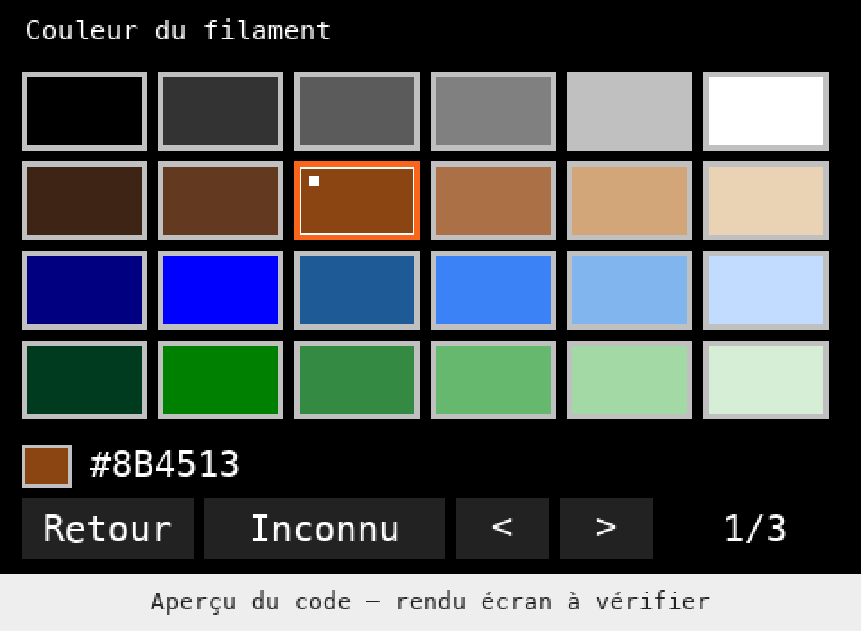
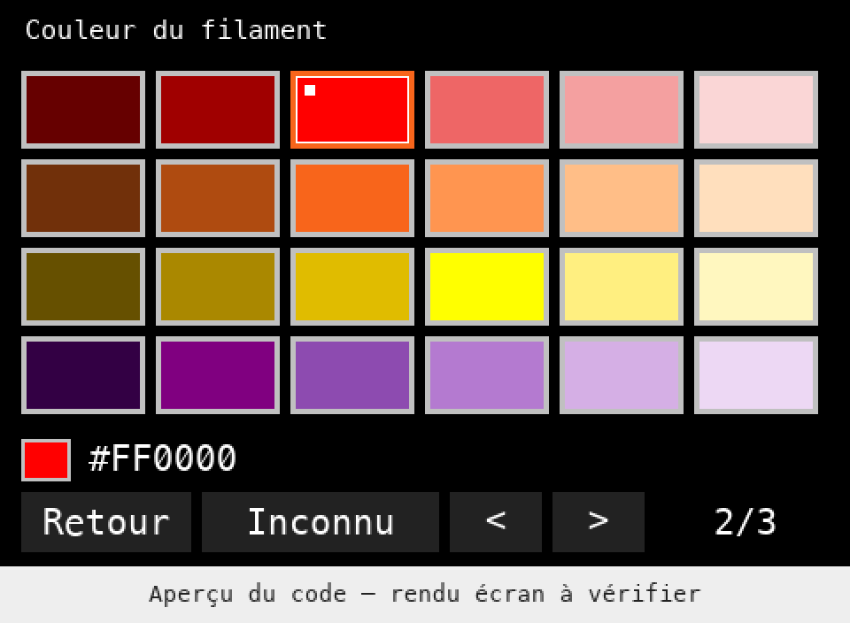
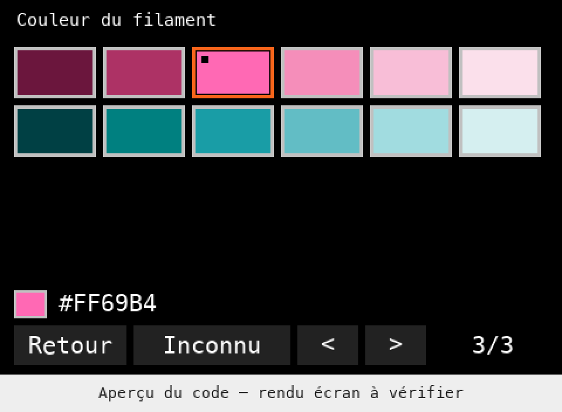

# Palette visuelle à nuances : prototype INDX color+2

Cette évolution remplace la liste de couleurs nommées du prototype `color+1`
par une palette de cases colorées. Elle répond au besoin de distinguer plusieurs
bobines bleues ou marron sur une CORE One + INDX à huit têtes.

**État : code compilé et tests logiciels réussis ; palette non vérifiée sur
l’écran d’une imprimante.** La confirmation matérielle du prototype `color+1`
ne valide pas cette nouvelle interface. La version publique
[v0.1.0](https://github.com/Coben-3d/Prusa-Firmware-Buddy/releases/tag/local-filaments-v0.1.0)
conserve son menu et ses fichiers d’origine.

## Fonctionnement préparé

- 60 couleurs, regroupées en dix lignes de six nuances du foncé au clair.
- Trois pages de quatre lignes au maximum ; les deux dernières lignes sont
  vides sur la troisième page et ne sont pas sélectionnables.
- Première page : gris, marrons, bleus, verts. Deuxième : rouges, oranges,
  jaunes, violets. Troisième : roses et tons bleu-vert.
- Navigation à la molette ; appuyer choisit la case. Les clics tactiles sont
  également gérés par le code, à vérifier sur une machine où le tactile est actif.
- Un cadre indique la case visée, un petit repère la couleur déjà choisie.
- L’aperçu et le code `#RRGGBB` changent pendant la navigation. Un clic sur une
  case confirme le choix temporaire et revient au menu de chargement.
- `Retour` et les gestes latéraux de retour annulent. `Inconnu` constitue un
  choix explicite distinct du noir. `<` et `>` parcourent les pages en boucle.
- Le menu de chargement affiche désormais un carré et le code RGB pour une
  couleur connue ; le choix de matière suit comme auparavant.
- Le chargement réussi confirme la couleur de la tête visée avec le mécanisme
  existant. Ouvrir/refermer la palette ne modifie pas les déclarations persistées.

Les anciens codes, y compris le marron `#8B4513`, restent dans la palette. Une
couleur déjà enregistrée hors palette est conservée à l’ouverture et à
l’annulation ; elle n’est pas arrondie vers une teinte voisine.

Exemples utiles : marrons `#3E2415`, `#8B4513`, `#D2A679` ; bleus `#000080`,
`#3B82F6`, `#C1DCFF`. Ce sont des teintes de représentation choisies pour le
projet, **pas des références fabricants ou des mesures des bobines**.
L’écran et Slicer peuvent les afficher différemment. Les couches, la lumière et
la finition du filament influent aussi sur l’apparence d’une pièce imprimée.

## Aperçus

Ces images utilisent les positions et codes de la nouvelle interface. Elles
sont dessinées sur ordinateur, avec une police illustrative et un en-tête simplifié : **ce ne sont pas
des captures du firmware ou de l’imprimante**.

## Ce qui est vérifié dans le code

Le code officiel 6.9.1 fournit les
[rectangles colorés](https://github.com/prusa3d/Prusa-Firmware-Buddy/blob/f1a123aba502bf8b043fcd9c779ee20b9253a62e/src/guiapi/src/window_colored_rect.cpp),
[événements de molette et tactiles](https://github.com/prusa3d/Prusa-Firmware-Buddy/blob/f1a123aba502bf8b043fcd9c779ee20b9253a62e/src/guiapi/include/window_event.hpp)
et [dialogues modaux avec boutons](https://github.com/prusa3d/Prusa-Firmware-Buddy/blob/f1a123aba502bf8b043fcd9c779ee20b9253a62e/src/gui/dialogs/dialog_numeric_input.cpp).
Le sélecteur de couleur est un nouveau dialogue du projet construit sur ces
éléments ; aucune commande de changement de couleur propre au firmware officiel
n’est supposée disponible.

La cible utilise un écran 480 × 320. Le pilote
[ILI9488](https://github.com/prusa3d/Prusa-Firmware-Buddy/blob/f1a123aba502bf8b043fcd9c779ee20b9253a62e/src/guiapi/include/ili9488.hpp)
convertit la couleur affichée en RGB666. Le code choisi reste sur 24 bits dans
le journal et l’API ; la conversion d’affichage ne réduit pas le code transmis.

Le journal INDX et la route `GET /api/v1/filaments` du projet transportent déjà
`#RRGGBB`, indépendamment de l’ancienne liste de noms.
Le [parseur du Slicer du projet](https://github.com/Coben-3d/PrusaSlicer/blob/b05b5ae4bba0372a7c69138ab48a6a093741a46e/src/slic3r/Utils/LoadedFilamentColor.cpp)
accepte tout code hexadécimal valide. Le Slicer publié avec v0.1.0 peut donc
recevoir ces nuances : aucune nouvelle API, aucun nouvel accès cloud, aucun
changement de version du journal et aucune recompilation de Slicer ne sont
nécessaires pour cette palette.

## Fichiers et coût

| Fichier | Rôle |
|---|---|
| `src/common/filament_color_palette.hpp` | 60 codes RGB et état de sélection/annulation/navigation |
| `src/gui/dialogs/dialog_filament_color.*` | Grille, aperçu, pages, événements et dialogue |
| `src/gui/screen/screen_preheat.cpp` | Ouverture du dialogue et carré/code dans le menu |
| `src/gui/dialogs/CMakeLists.txt` | Compilation pour les variantes INDX |
| `tests/unit/common/filament_color_palette_tests.cpp` | Choix des 60 nuances, annulation, noir/inconnu, limites de navigation |
| `tests/unit/common/loaded_filament_color_tests.cpp` | Conservation exacte de plusieurs marrons et bleus dans journal/API |

La table RGB occupe 240 octets constants. Le dialogue mesure 636 octets avec
le compilateur ARM utilisé ; une assertion limite sa taille à 768 octets.
Il ne crée ni tableau de 60 widgets ni allocation dynamique pour les cases.
Cela ne remplace pas une mesure du maximum de pile en fonctionnement réel.

À chaque mise à jour Prusa, revoir le menu de préchauffage, les événements GUI,
les règles de capture/restauration du focus et les dimensions de l’écran.
Une grille à nuances évite ici le développement d’un éditeur HSV/RGB complet.
La palette actuelle ne permet pas de saisir un nouveau code libre sur l’écran.
Un tel éditeur serait une évolution distincte.

## Validation et essai restant

- Compilation ARM GCC 13.3.1 : cible `COREONE_INDX`, `XBUDDY`, Release,
  `6.9.1-color+2`, `BUILD_NUMBER=2`, `BOOTLOADER=EMPTY`, `BOOTLOADER_UPDATE=OFF`.
- Tests palette : 4 cas, 614 assertions réussies.
- Tests journal/API : 10 cas, 2 489 assertions réussies.
- Contrat Slicer : réponse produite par le renderer firmware puis reçue par le
  client PrusaLink compilé via un serveur fictif sur `127.0.0.1` ; les trois
  marrons et trois bleus arrivent sans modification de leurs codes ni indices.
- Contrôle du BBF : checksum principal et hash des ressources valides, signature
  personnalisée vide, aucune entrée de bootloader 11/12 ; les trois programmes
  secondaires sont identiques octet pour octet à ceux de l’officiel 6.9.1.
- Aucun accès à l’imprimante, aucune modification de clé USB, aucun flash pour
  cette évolution. Aucun test matériel du sélecteur n’est revendiqué.

Sources utilisées pour le BBF : `855b9975c3d574a3e0ef6d1dd9e7ad992487ed4d` (sans modifications locales).

Fichier local préparé : `COREONE_INDX_6.9.1-color+2-palette-prototype.bbf` (3,639,074 octets).
SHA-256 : `adec1df6b37496bdc78cf9d3ccecf836083afefc16f70414ec65ccb6a52da089`.

Avant publication d’un nouveau téléchargement : vérifier sur la machine le
rendu des nuances, le cadre et le code ; la molette et, si activé, le tactile ;
les boutons de page ; l’annulation ; le choix PLA puis le chargement normal ;
la synchronisation de plusieurs marrons/bleus sur les bonnes lignes Slicer ;
la conservation après redémarrage. Confirmer aussi qu’une tête dont la couleur
n’a pas été changée conserve son réglage. Les essais physiques restent manuels.

Ce BBF est pour la CORE One + INDX ciblée ici. Les conditions de firmware
personnalisé et la procédure de retour à l’officiel restent celles du
[guide commun](LOCAL-FILAMENTS.md). Le portage de cette nouvelle grille sur MK4
n’a pas été réalisé dans cette évolution.
